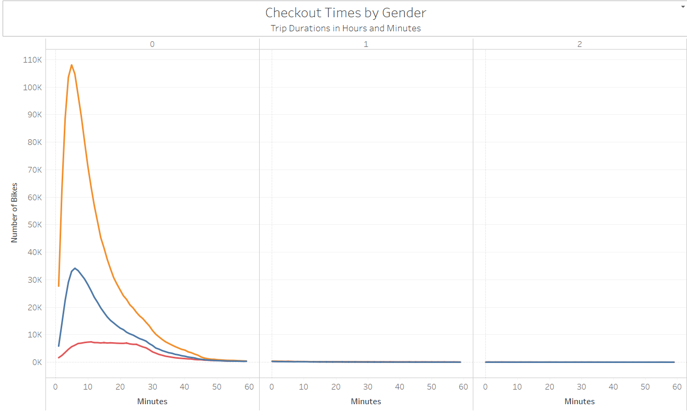

# DABC-bikesharing

## Overview:
The purpose of this analysis is to gain valuable insights into the usage of NYC Citibikes by visualizing usage data on Tableau in order to assess the feasibility of applying the same business idea elsewhere.

## Results

[Link to Dashboard](https://public.tableau.com/profile/anthony.ng2094#!/vizhome/NYC_CitiBike_Challenge_16126397208610/NYCCitiBikeStory?publish=yes)

Below dashboard presents a summary of the CitiBike usage by Gender and User Type. In general, most users of CitiBike are male subscribers who tend to use more of the bikes as the working week progresses.

</img>

Taking a closer look at the data shows that most trips on workdays are taken during commuting hours at around 7-8 am and 5-6 pm, whereas the usage is more evenly distributed throughout the day on weekends. In addition, although females riders take less trips than males, their trips' duration are longer. As the age groups get older, they tend to take shorter trips.

</img>

As illustrated below, all trips were finished within an hour. In fact, most trips (80%) are checked out within 20 minutes. In addition, the most common trip duration is only 5 minutes long regardless of the gender.

</img>

By examining the top starting and ending locations of bike rides, we gain insights into why most trips are finished in 20 minutes. Top Starting Locations are clustered around Lower Manhattan, especially on weekdays, and most trips also end in Lower Manhattan. Bikes in certain locations are predominately used by non-subscribers, such as Central Park, and locations nearby the Hudson River.

</img>
</img>

While subscribers contriubted to the majority of the of the trips, their trips are much shorter than trips taken by customers  (non-subscribers). On average, non-subscribers take trips lasting twice as long as subscribers. This suggests that there is an opportunity for price-discrimination where charges for non-subscribers are higher, and charges for subscribers are lower, to maximize profit from both types of users.

</img>

Within the month of August, there were more than 2.3 million number of trips taken. Inevitably, bikes will require a high level of regular maintenance, where some bikes may be used more often than others. As shown below, most bikes were used very lightly (a few days). However, certain bikes were used significantly more than others. These bikes would need to be flagged for more maintenance.

</img>

As presented in below heat map, bike usage is clustered around commuting hours in the morning and in the evening, with significant spike in usages on Thursdays. Weekend usage is more evenly spread from 10am to 7pm, with higher usage on Saturdays. Therefore, the best time for maintenance would be at night when demand is at its lowest, followed by 10am to 4pm on weekdays.

</img>

## Summary

In summary, CitiBike usage are different across multiple demographic groups. Male riders tend to take more bike trips, whereas female riders tend to take longer trips. Younger riders also tend to take longer trips than older riders. Subscribers tend to take more but much shorter trips than non-subscribers. In addition, subscribers mostly use the bikes for commuting purposes before and after work, whereas non-subscribers tend to use the bikes more heavily on weekends and around touristic locations; regardless of the purpose of using CitiBike, most trips are fairly short and only around 10% of trips last longer than 30 minutes. All of the above are all important factors to consider when applying the same business concept in another city. For example, bikes should be made available in the most popular locations based on weekdays or weekends and hours of the day. Pricing can be different amongst different types of users to maximize profits. Lastly, maintenances should be scheduled to maximize the number of bikes available depending on the demand.  

To facilitate further analysis, we could visualize the number of rides used by different age groups and usertypes. We could gain 2 key insights from this visualization. First, which age group tend to ride CitiBike the most? Secondly, which age group are most likely to subscribe to CitiBike. By understanding the reasons behind these findings, we could further adjust the pricing scheme to account for the fundamental differences in need and preferences of various groups of users.

Lastly, we could create a map to visualize the starting locations where the markers' size would depend on the total number of bike rides, the color would depend on the age, and adding the user types as a filter. Thereby, we would gain insights into which locations are more popular for different age groups, and do they tend to be subscribers or non-subscribers.